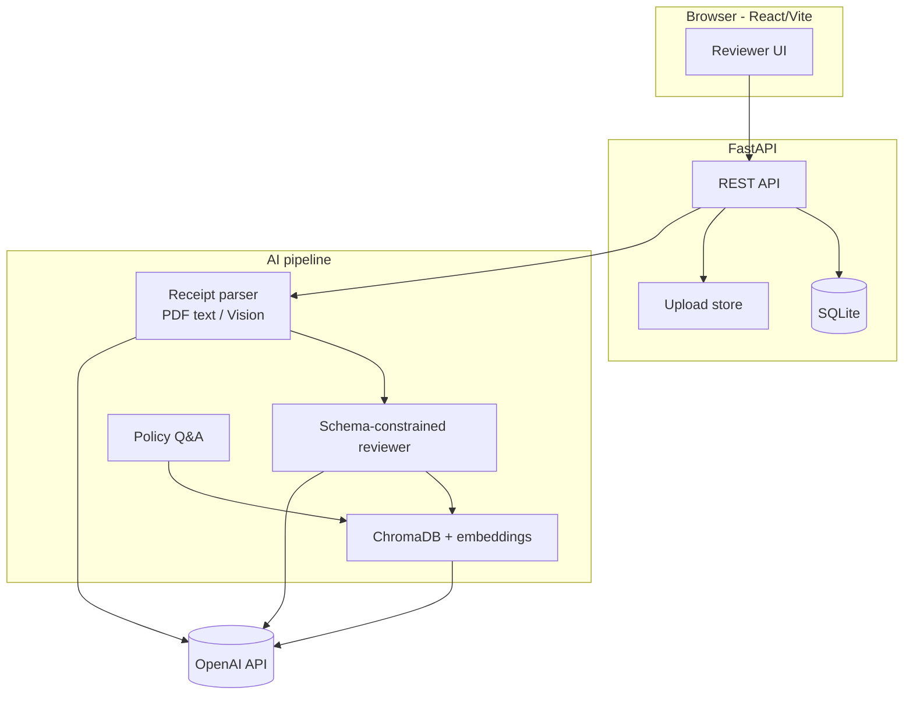

# Northwind Logistics — AI Expense Pre-Review

**Live demo:** _Add your deployed URL here after Render/Railway deploy_

**Repo:** https://github.com/yashaswip/northwind-expense-review

Finance reviewers use this app to upload trip receipts, run an AI-assisted pre-review against company policies, override verdicts with an audit trail, browse submission history, and ask grounded policy questions.

> **Same-day submit?** Follow [SUBMIT_TODAY.md](./SUBMIT_TODAY.md) step-by-step.

## Quick start (local)

### Prerequisites

- Python 3.11+
- Node 20+
- [OpenAI API key](https://platform.openai.com/api-keys) (used for embeddings, receipt extraction, review, and policy Q&A)

### 1. Policies & sample data

Place policy PDFs in `data/policies/` and sample submissions in `data/submissions/` (already copied from your `case_study` folder). If you receive the full ~30-policy pack, drop all PDFs into `data/policies/` and restart — the index rebuilds on first run or via `POST /api/policy/reindex`.

### 2. Backend

```bash
cd backend
python3 -m venv .venv
source .venv/bin/activate   # Windows: .venv\Scripts\activate
pip install -r requirements.txt
cp ../.env.example ../.env    # add OPENAI_API_KEY
uvicorn app.main:app --reload --port 8000
```

On startup the app:

- Creates SQLite tables (`northwind.db`)
- Seeds five employees from `data/submissions/*/employee_info.json`
- Indexes policies into ChromaDB (`chroma_data/`)

### 3. Frontend

```bash
cd frontend
npm install
npm run dev
```

Open http://localhost:5173

### Demo flow

1. **History** — seeded employees appear automatically.
2. **New submission** — pick Sarah Chen (or any employee), enter trip context.
3. On the submission page, use **Load sample folder** (e.g. `03_dinner_over_cap`) then **Run AI pre-review**.
4. Review flagged line items (amber/red borders), policy quotes, and confidence.
5. **Override verdict** with a required comment (persisted + auditable).
6. **Policy Q&A** — try “What is the solo dinner cap?” vs an off-topic question.

## Architecture



| Layer | Choice | Why |
|-------|--------|-----|
| **UI** | React + Vite | Fast dev, clear separation; finance reviewers need a real browser UI |
| **API** | FastAPI | Typed schemas, async uploads, easy OpenAPI |
| **Persistence** | SQLite | Survives restarts; zero ops for case study; auditable overrides |
| **Policy retrieval** | ChromaDB + `text-embedding-3-small` | Simple local vector store; section-aware chunking on policy PDFs |
| **Receipts** | pdfplumber text first, vision fallback | PDFs in the sample pack are text-heavy; JPG/PNG/TXT use the same vision path graders will test |
| **Review output** | JSON schema (strict) | Verdict, confidence, reasoning, citations — no fragile free-text parsing |
| **Citations** | Post-validation against retrieved chunks | Quotes must appear verbatim in retrieved text or verdict downgrades to `needs_review` |

### Verdict model

| Verdict | Meaning |
|---------|---------|
| `compliant` | Clearly within policy |
| `flagged` | Likely issue or missing documentation |
| `rejected` | Clear violation |
| `needs_review` | Weak retrieval or ambiguous — honest “I don’t know” |

**Tradeoff:** We prefer `needs_review` over a confident wrong answer when retrieval score &lt; 0.35 or citations fail validation.

### Chunking

Policies are split on section headers (`2.1.`, etc.) with ~1.8k character chunks so cross-references like `TEP-002 §2.3` stay near the rules they cite. Document IDs are parsed from `Document: TEP-00X` headers.

## Evaluation harness

```bash
cd backend && source .venv/bin/activate
export OPENAI_API_KEY=...
python ../eval/run_eval.py --fixture ../eval/fixtures/example_expected.json
```

**Metrics:**

- **Verdict accuracy** — predicted vs expected per receipt (held-out JSON you provide after submission)
- **Citation accuracy** — cited `document_id` overlaps expected policy docs
- **Refusal accuracy** — policy Q&A correctly declines out-of-scope questions

Drop your graded fixture in any path and pass `--fixture path/to/held_out.json`. Optional `--api-url https://your-deploy.com` for live policy Q&A checks.

## Rough cost per submission

Assuming ~7 receipts, gpt-4o-mini, text-embedding-3-small:

| Step | ~Tokens | ~Cost |
|------|---------|-------|
| Policy index (amortized) | — | negligible per submission after first ingest |
| 7× receipt extraction | ~3k in / 500 out | ~$0.01 |
| 7× review + retrieval | ~8k in / 400 out | ~$0.02 |
| Embeddings (7 queries) | ~2k | ~$0.0001 |
| **Total** | | **~$0.03–0.05 / submission** |

At **10,000 submissions/day**: ~$300–500/day inference + horizontal API workers (queue + 20–50 replicas), managed Postgres if you outgrow SQLite, and Redis for job queue. Batch review during off-peak; cache retrieval by `(category, grade, trip_type)` hash.

## Deployment

**Docker (single container — API + built UI):**

```bash
docker build -t northwind-expense .
docker run -p 8000:8000 -e OPENAI_API_KEY=sk-... northwind-expense
```

**Render / Railway:** Connect repo, set `OPENAI_API_KEY`, use Dockerfile or:

- Build: `cd frontend && npm install && npm run build`
- Start: `cd backend && pip install -r requirements.txt && uvicorn app.main:app --host 0.0.0.0 --port $PORT`
- Mount persistent disk for `northwind.db`, `chroma_data`, `uploads`

Serve `frontend/dist` via FastAPI static mount (already wired in `main.py`).

## What I’d do next

- Add dedicated TEP-002/003 PDFs when the full policy pack is available (your folder has 8 PDFs; TEP-002/003 content also appears inside the large TEP-001 bundle)
- Async job queue for review (Celery/ARQ) so uploads return immediately
- Human-in-the-loop feedback to tune retrieval thresholds
- OCR fallback (Tesseract) before vision for cost control
- Per-line partial reimbursement (e.g. alcohol stripped from food total)
- SSO + role-based audit export for finance

## Project layout

```
backend/          FastAPI app, SQLite, Chroma, review pipeline
frontend/         React reviewer UI
data/policies/    Policy PDFs
data/submissions/ Sample employees + receipts
eval/             Grading harness + example fixture
```

## API keys

| Variable | Required | Description |
|----------|----------|-------------|
| `OPENAI_API_KEY` | Yes | Embeddings + LLM calls |

See `.env.example` for optional model overrides.
